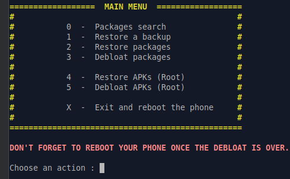
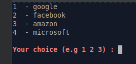

# android-deGaFAM-shizuku
Android debloath és deGoogle kábellel valamint kábel nélkül Linux alatt

tl;dr

Android debloath és deGoogle kábellel valamint kábel nélkül Linux alatt:

I. Universal Android Debloater - régi
- gitlab.com/W1nst0n/universal-android-debloater

II. Universal Android Debloater GUI - új
- github.com/0x192/universal-android-debloater

III. Shizuku App és Canta modulja
- shizuku.rikka.app/download [moe.shizuku.privileged.api]
- f-droid.org/hu/packages/org.samo_lego.canta

IV. Systemless DeGoogler
- kistesó, bash customize.sh

kell
- motiváció, idetaláltál - ez pipa
- némi gyakorlat, 10 elrontott telefonból 8 megjavitott, felújitott
- sudo apt-get install adb fastboot heimdall-flash android-sdk-platform-tools
- build number . . . . developer options
- kábel és USB debugging vagy Wireless debugging, ez utóbbi elérése Android verzió függő
- droid-ify, repótelepités felmerülhet

nem kell
- root, amúgy is kimenőben a divatból, a tűzfal megfelelő védelmet nyújthat az adatszivárgás ellen, a netbank meg..
- Odin, SP Flash, Magisk, Qualcomm Flash, SN Writer, adb és fastboot kódrengeteg..
- com.google.android.gm, com.google.android.gms, com.android.vending, Google/Facebook/Amazon/Microsoft.. [lol]

 

 

I. van kábel, működik az adatkapcsolat

- Az „Universal Android Debloater” korábbi, bash script futtatását lehetővé tévő verziója szerintem nagyobb mozgásteret biztosit, mint az új GUI-el fejlesztett változat.

- a telefon bekapcsolt és képernyőzár-ügyileg feloldott állapotban van
- terminál inditása az UAD mappájából
- engedélykérésre pacsi
- bash debloat_script.sh
- backup nem köszi, 3, 2 vagy 3.. és utánunk az özönviz
- x-el fejezzük be a folyamatot, a telefon újraindul

 

 

Ezzel a metódussal sem törlünk, mint a Shizuku App esetében, nem babráljuk meg a Gyári Visszaállitás hátterében rejtőzködő Stock ROM image-et, csak képesek vagyunk uninstall-álni a system appokat, ha már nincs a készülékünkre CyanogenMod, LineageOS, CrDroid, GSI Treble, AOSP, Resurrection Remix, amikkel biztonságosan és szabadon használhatnánk a készüléket - kibővitve funkcionalitását és élettartamát.

Érdemes közben nézni a készüléket, ahogyan egyre-másra tűnnek el a levakarhatatlannak tűnő makacs GFAM és brand applikációk ikonjai, melyek akkor is futnak és visszabeszélnek, ha letiltottuk, leállitottuk és megvontuk tőlük az internetkapcsolatot. Én mindig annyira izgulok ilyenkor, hogy elfelejtem videóra venni.

 

 

III.  nincs kábeles adatkapcsolat, csak töltődik jó esetben, így navigációra, ébresztőórának, bármi másnak még pont jó lesz

A Shizuku egy készüléken futtatható apk, nem kell sem kábel, sem számitógép hozzá.

- feltelepitjük a Shizuku-t és a Canta-t
- inditáskor párositani kell Shizuku-ban, ez egyfajta engedélykérés a debug funkcióhoz, csak itt a levegőben úgymond és nem kábeles kapcsolattal
- ezek után csak pipálgatunk a Canta-ban és nyomkodjuk a kuka-ikont

 

 

A Shizuku ritkán jön jól, de akkor pótolhatatlan. Például amikor közeli hozzátartozónk BMX-el átugratna a telefon felett, ami videofelvételt készit a mutatványról és mindez félresikerül, mitől kezdve valami miatt csak tölt a telefon, adatkapcsolat nincs, de ezt is csak fél képernyőn élvezhetjük. Vagy, ha egy erdőben ülve debloath-olnánk valami furcsa és megmagyarázhatatlan okból. Esetleg úgy alakul, hogy újrahúzzuk a telefonunkat egy távoli ország repterén becsekkolás előtt.

Mindkét művelet esetén a gyári visszaállitás maga a backup, tehát van visszaút, semmi sem vész el, csak háttérbe szorul.

